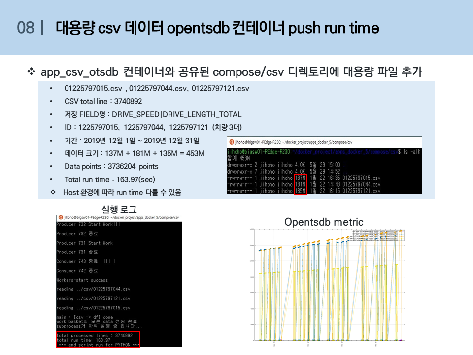

# csv2tsdb_and_preprocessing

## 전체 구조

- opentsdb: 컨테이너 실행되어 opentdb 구축
- app_csv_otsdb: host의 원본 CSV file이 저장된 디렉토리를 공유하여 읽어 실행한 opentsdb 컨테이너로 데이터를 put
- app_rm_outlier: opentsdb 컨테이너로부터 데이터를 쿼리 하여 전처리 과정(이상치 제거) 진행 후 opentsdb 컨테이너로 put
- app_get_driving: opentsdb 컨테이너로 부터 데이터를 쿼리 하여 주행 구간 추출하고 opentsdb 컨테이너로 put

## 사전준비
  1.  docker/docker-compose 설치
      https://hcnam.tistory.com/25
      
  2. 윈도우 docker/docker-compose 설치
      https://steemit.com/kr/@mystarlight/docker

      - 도커 툴박스 설치

        https://github.com/docker/toolbox/releases

## 사용방법
  1. github repo clone 혹은 zip파일 다운로드
  
      - git clone
      
            $ git clone https://github.com/ChulseoungChae/docker-compose.git
        
        or
      
      - 아래링크에서 zip파일 다운로드 후 압축해제, 원하는 디렉토리로 
      
          [Link(https://github.com/ChulseoungChae/docker-compose/releases)](https://github.com/ChulseoungChae/docker-compose/releases)
      
  2. compose 디렉토리 이동 및 docker-compose.yml 파일 수정

        - compose 디렉토리로 이동

              $ cd docker-compose/csv2tsdb_and_preprocessing/compose 

        - host ip 확인
             
            리눅스 – ifcongif
            윈도우(cmd/powershell) – ipconfig
            윈도우(docker-toolbox) – docker machine ip

        - docker-compose.yml 파일 수정
          - 아래 environment 의 ip 주소, port 는 데이터를 입력할 openTSDB 컨테이너에 접근 가능한 접근 정보이어야 함         
            ※ docker-compose.yml파일에서 각 environment부분의 ip는 위에서 확인한 host ip를 입력해줘야함. 나머지 ports나 변수들은 사용자의 상황에 맞게 입력.

            
            

​  3. opentsdb 컨테이너 실행 및 구동 확인 ( $ docker -compose up -d opentsdb)

    $ docker-compose up -d opentsdb
 
  - 웹 접속은 docker-compose.yml파일에서 정의한 ip:port로 로컬에서 접속
  

  4. app_csv_otsdb 컨테이너 실행 및 구동 확인
    
    $ docker-compose up -d app_csv_otsdb

  - opentsdb web 접속 확인(아래 정보 선택 및 입력)

        From : 2020/01/01
        To : 2020/01/08
        Metric : csv_data
        Aggregator: None

      

  5. app_rm_outlier 컨테이너 실행 및 구동 확인
    
    $ docker-compose up -d app_rm_outlier

  - opentsdb web 접속 확인(아래 정보 선택 및 입력)

        From : 2020/01/01
        To : 2020/01/08
        Metric : rm_outlier
        Aggregator: None

      

  6. app_get_driving 컨테이너 실행 및 구동 확인
  
    $ docker-compose up -d app_get_driving

  - opentsdb web 접속 확인(아래 정보 선택 및 입력)

        From : 2020/01/01
        To : 2020/01/08
        Metric : driving_startend
        Aggregator: None

      

## wget 으로 데이터 입력 여부를 확인
    
  - opentsdb 웹 접속하여 데이터 조회한 화면

      http://192.168.99.100:60010/#start=2020/01/01-00:00:00&end=2020/01/08-00:00:00&m=none:csv_data&o=&yrange=%5B0:%5D&wxh=938x741&style=linespoint

      

  - 위 화면에서 url의 '#'(드래그한 부분)을 'api/query?' 로 바꾸면 아래 사진과 같이 json형태로 데이터를 확인할 수 있음

      

      이 데이터를 리눅스터미널에서 wget을 이용하여 파일로 내려받을수 있다.

        $ wget 'http://[ip]:[port]/api/query?start=2020/01/01-00:00:00&end=2020/01/08-00:00:00&m=none:[metric name]&o=&yrange=%5B0:%5D&wxh=938x741&style=linespoint' -O filename.txt

  - 테스트 화면
      

## 코드 수정 및 실행

  - 각 컨테이너를 실행시킨 후 원하는 파일을 수정하길 원한다면 다음과 같은 방법으로 수정하고 실행중인 컨테이너에서 전처리 코드만 다시 실행 가능함(ip, port, metric이름과 같은 변수들은 compose에서 입력하도록 하였으나 쿼리 기간 등을 수정하길 원할 때, 혹은 python코드를 수정할 때)

  - 수정 및 실행

    ① 각 컨테이너 볼륨 마운트한 디렉토리로 이동

        ex) $ cd app_rmoutlier_volume/ 

    ② 수정하려고 하는 파일 편집기로 열기

        ex) vim this_run.sh(윈도우에서는 code editor로 수정 가능)

    ③ 수정 후 실행되고있는 컨테이너 Name 확인

        ex) docker ps –a

    ④ 수정한 코드 실행

        ex) docker exec <컨테이너 name> bash /app/apps/02_otsdb_get_drive_startend/this_run.sh

## 대용량 csv데이터 opentsdb 컨테이너 put time

  

## 컨테이너 ssh 접속

    ssh root@[<호스트 ip> or <docker-toolbox ip>] -p <사용자가 지정한 포트번호>
