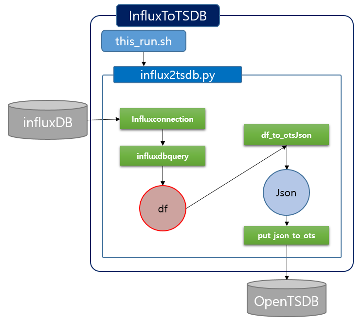
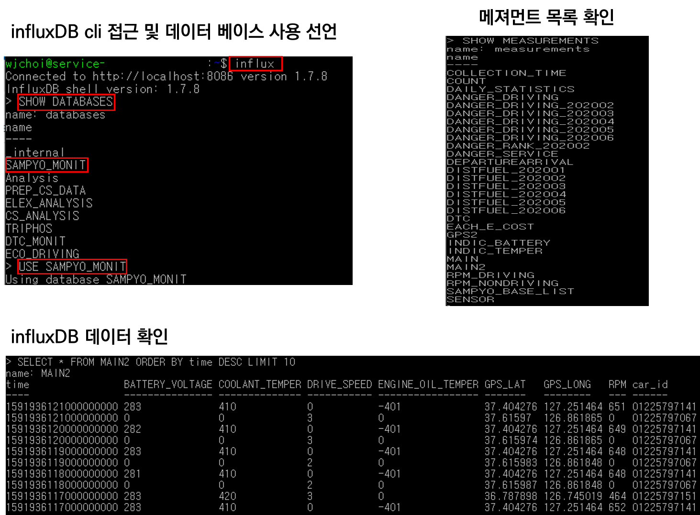
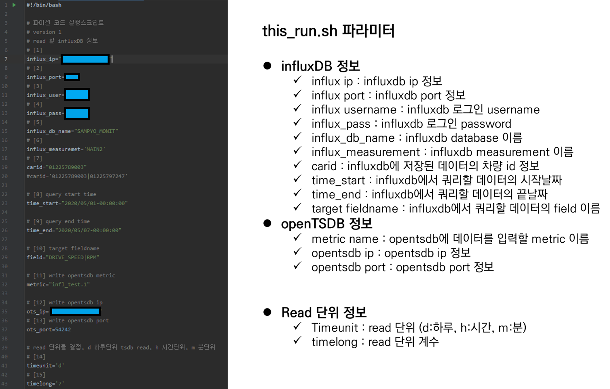
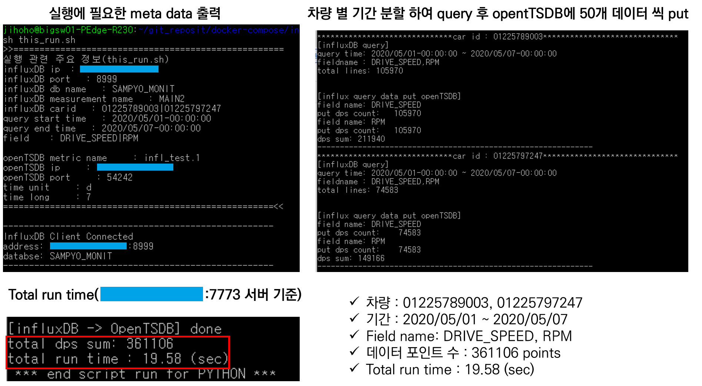
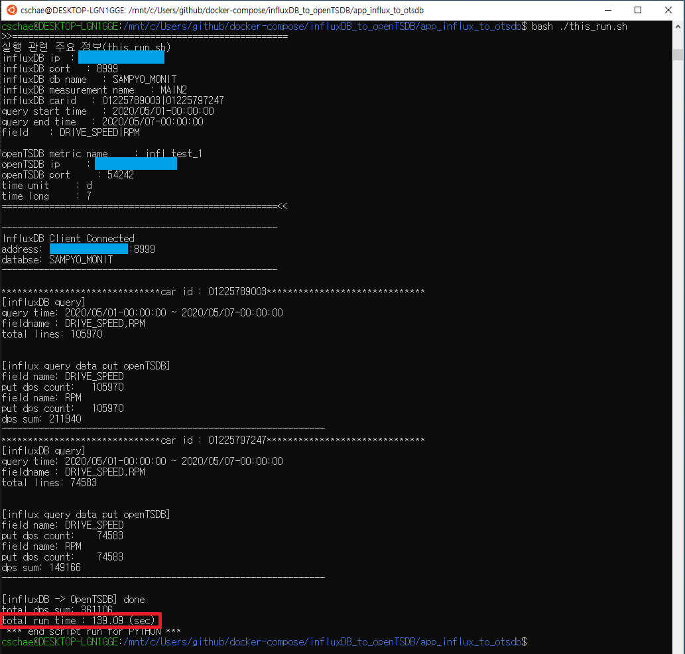
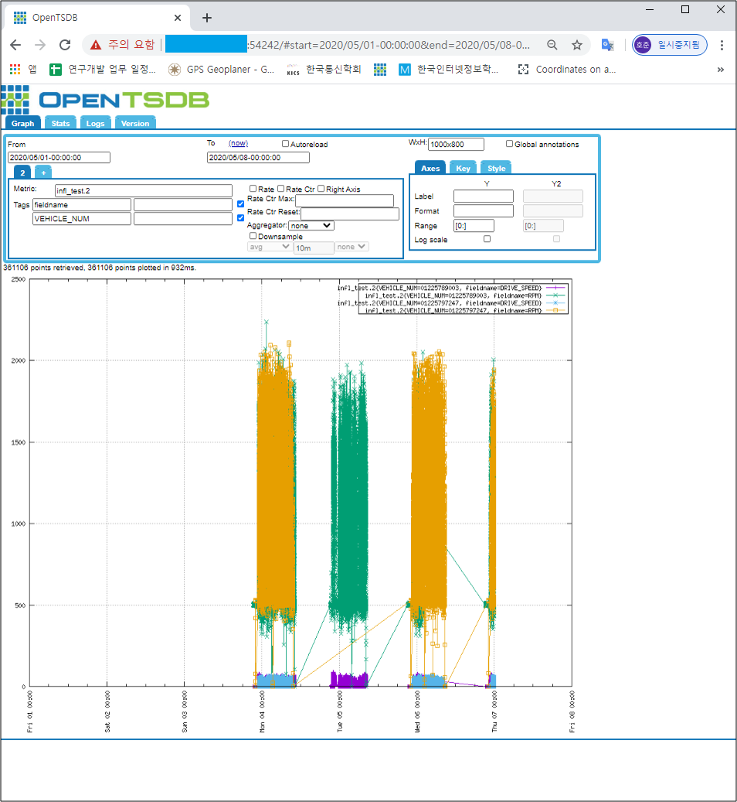

# app_influx_to_otsdb

- 데이터 분석을 위해 influxDB의 특정 기간의 데이터를 분할 query 하여 openTSDB 에 put

  

## influxDB 데이터 확인
  1. influxDB 서버 에서 확인

      - 서버 접속

            $ ssh cschae@*********** -p ***  
            # password : ******

      - influxDB 데이터 확인

          ```
          $ influx  #influxDB cli 접근
          $ SHOW DATABASES    #데이터베이스 목록 확인
          $ USE SAMPYO_MONIT    #데이터베이스 사용 선언
          $ SHOW MEASUREMENTS     #메져먼트(RDBMS의 TABLE, mongoDB의 collection) 목록 확인
          $ PRECISION RFC3339     #시간 출력 포맷 변경
          $ SELECT * FROM MAIN2 ORDER BY time DESC LIMIT 10     # influxDB 데이터 확인
          ```

          

          ​    

## meta data 및 코드 실행
- this_run.sh 스크립트의 influxDB 정보, openTSDB 정보 및 read 단위 설정

  

- 코드 실행

  ```
  $ bash ./this_run.sh
  ```

  - app_influx_to_otsdb/Influx2TSDB/this_run.sh  (multiporcessing 적용 전) 

    - 7773서버에서 실행

    

    - 로컬pc에서 실행

    

    

- openTSDB metric 확인

        # opentsdb ip와 port는 추후 docker-compose로 구성하면서 opentsdb container의 ip와 port로 바꿀예정
        opentsdb ip : ***********
        opentsdb port : 54242
        From : 2020/05/01
        To : 2020/05/08
        Metric : infl_test.2
        Aggregator: None

  

## 추후 계획
- docker container 이미지로 변환하여 docker-compose로 구성 및 테스트 [완료]

- 추후 대용량 데이터 처리 시 running time 개선을 위해 multiprocessing 적용 완료, 소스 코드는 아래 링크

  https://github.com/ChulseoungChae/docker-compose/tree/master/influxDB_to_openTSDB/app_influx_to_otsdb_v2

  
