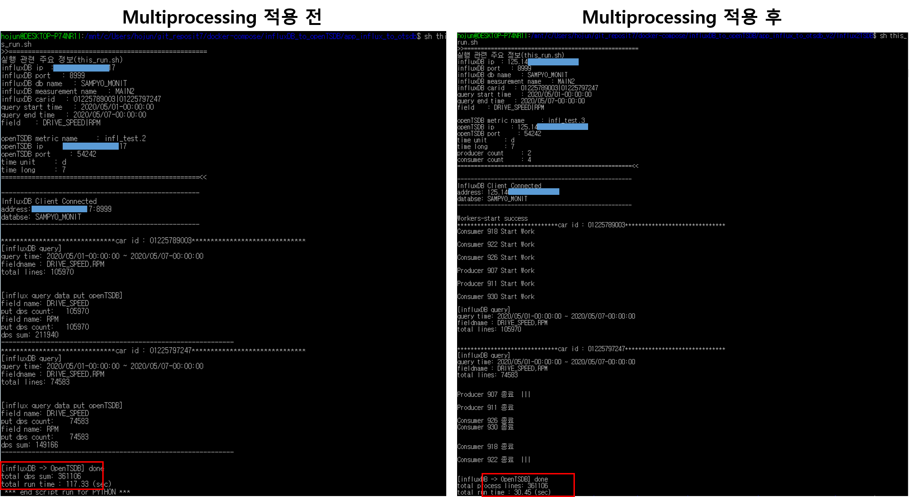
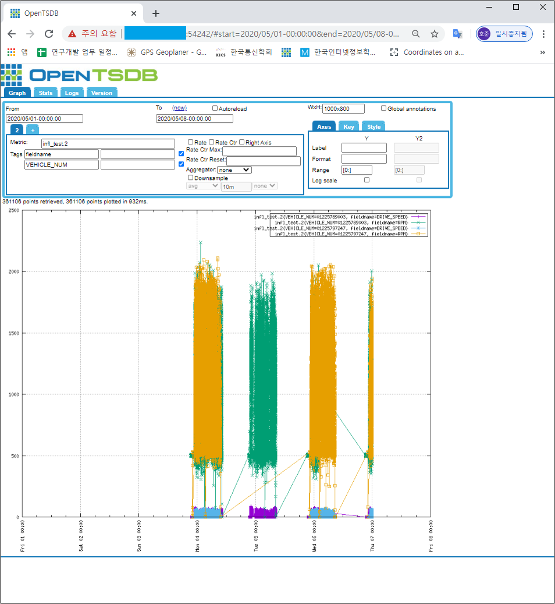

# app_influx_to_otsdb_v2

- 기존 app_influx_to_otsdb 코드에 multiprocessing 적용

    - producer : Dataframe의 해당 컬럼의 데이터를 openTSDB put 형식의 json으로 변환 하여 consumer queue에 put

    - consumner: consumer queue에서 json list 얻어 해당 openTSDB url에 put
- 기존 app_influx_to_otsdb 와 run time 비교

  ```
  $ bash ./Influx2TSDB/this_run.sh
  ```

      car id : 01225789003, 01225797247
      query start time : 2020/05/01-00:00:00
      query end time : 2020/05/07-00:00:00
      field name : DRIVE_SPEED, RPM
      total DPS count : 361,106
      total run time
      	- multiprocessing 적용 전 (app_influx_to_otsdb): 117.33(sec)
      	- multiprocessing 적용 후 (app_influx_to_otsdb_v2): 30.45(sec)

  

  

- openTSDB metric 확인

        opentsdb ip : ***********
        opentsdb port : 54242
        From : 2020/05/01
        To : 2020/05/08
        Metric : infl_test.2
        Aggregator: None
    





