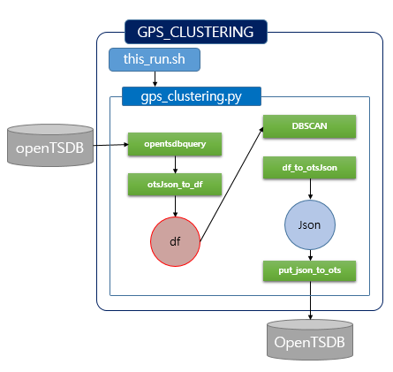
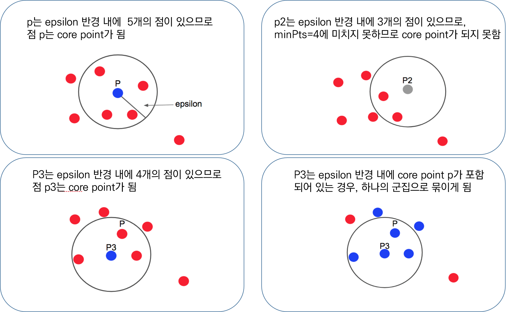
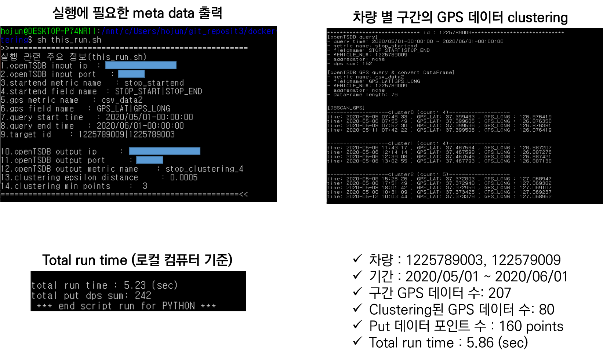
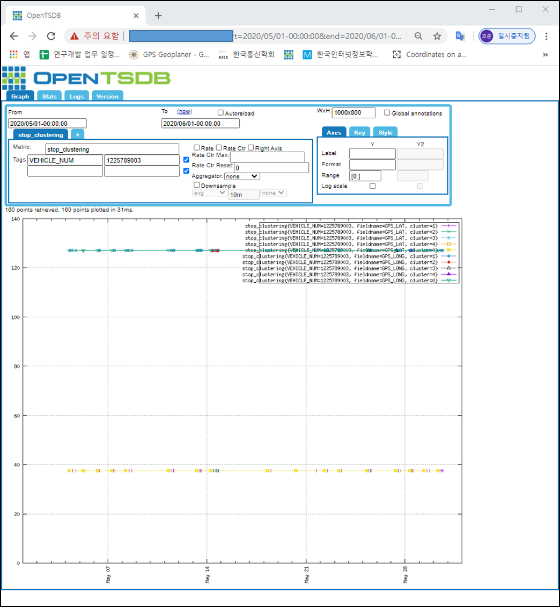

# app_clustering_gps

- 특정 구간의 GPS 데이터를 clustering 하여 주요 거점(GPS_LAT, GPS_LONG) 을 openTSDB에 put

  

- DBSCAN(Density-based spatial clustering of applications with noise)이란

  - k-means 기법, Hierarchical 클러스터링의 경우 군집간의 거리를 이용하여 클러스터링 하는 방법인 반면에, DBSCAN은 밀도 기반의 클러스터링은 점이 세밀하게 몰려 있어서 밀도가 높은 부분을 클러스터링 하는 방식이다.(k-means 기법과 다르게 클러스터의 수 지정 안해도 됨)
  - 점 P가 있다고 할 때, 점 p를 중심으로 e(epsilon)내에 점이 m(min points)개 이상 있으면 하나의 군집으로 판단하고, 그 점을 core point라고 한다. core point가 서로 다른 core point의 군집의 일부가 되면 서로 연결 되어 있다고 하고 하나의 군집으로 연결한다.
  - 아래의 그림은 minPts = 4 일 경우 clustering 하는 과정이다.

  


## meta data 및 코드 실행
- this_run.sh 스크립트의 influxDB 정보, openTSDB 정보 및 read 단위 설정

  

- 코드 실행

  ```
  $ bash ./this_run.sh
  ```

  - 로컬pc에서 실행

  

  

- openTSDB metric 확인

        # opentsdb ip와 port는 추후 docker-compose로 구성하면서 opentsdb container의 ip와 port로 바꿀예정
        opentsdb ip : ***********
        opentsdb port : 54242
        From : 2020/05/01
        To : 2020/06/01
        Metric : stop_clustering
        VEHICLE_NUM : 1225789003|1225789009
    cluster : [cluster 번호 0~]
      Aggregator: None
  
  

