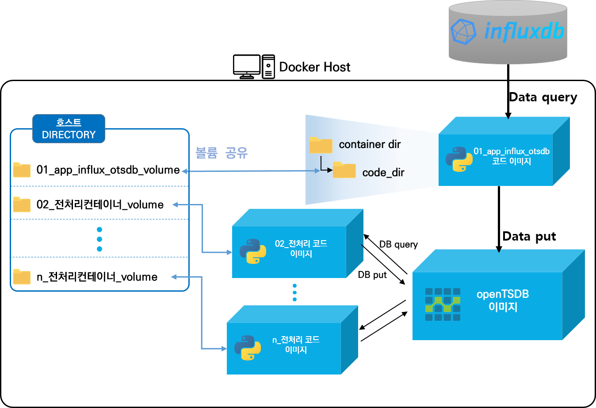
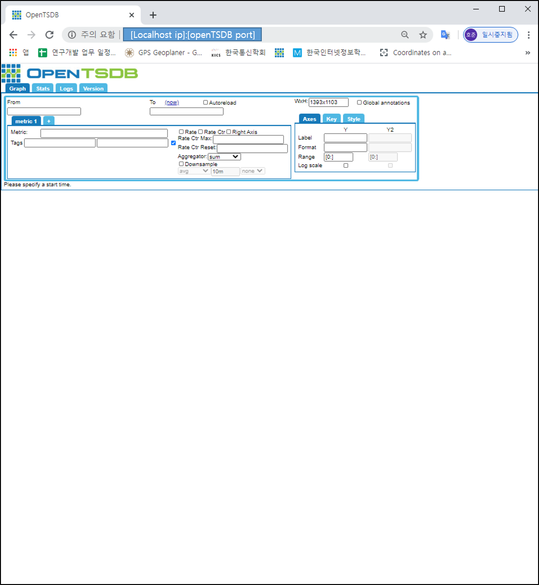
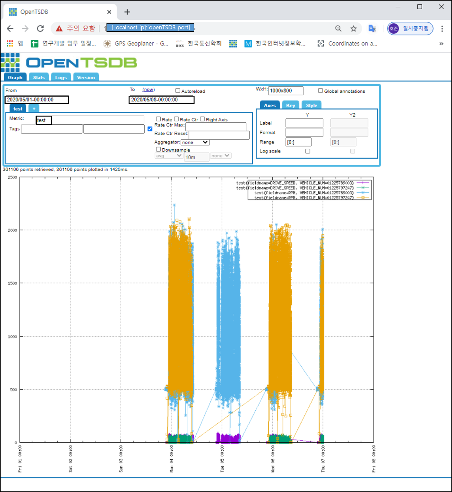
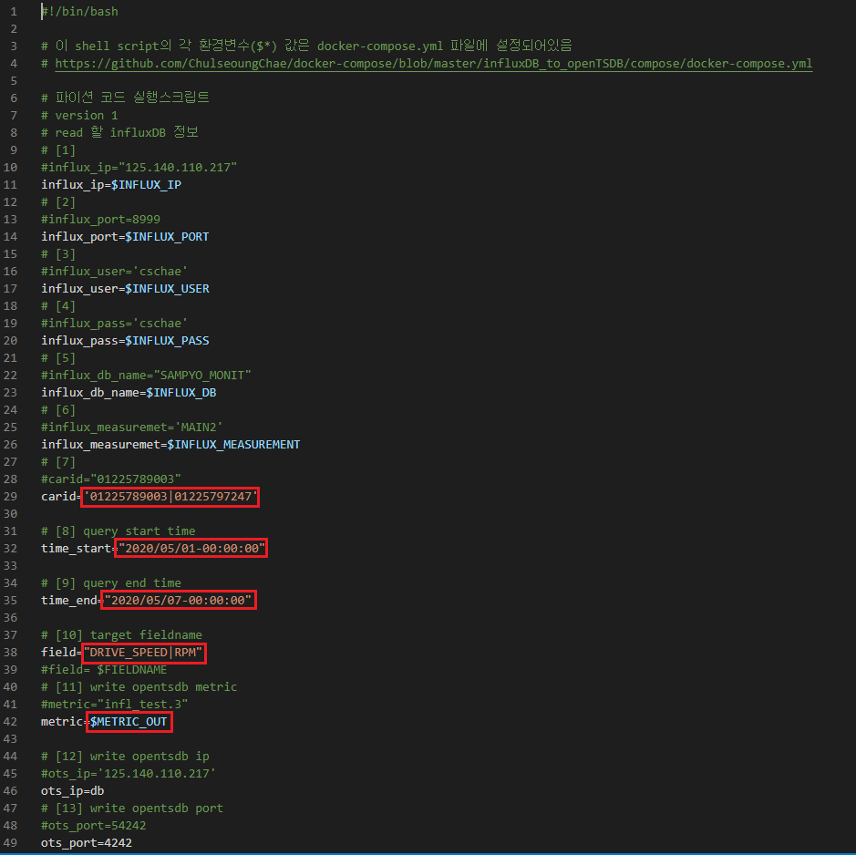
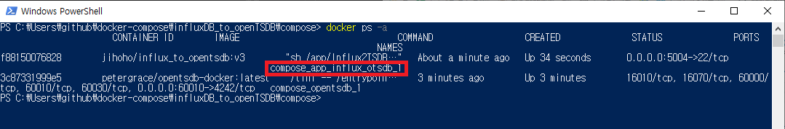

# 전체내용 수정중
# influxDB_to_openTSDB



- opentsdb: 컨테이너 실행되어 openTSDB 구축
- app_influx_otsdb: 데이터 분석을 위해 influxDB에서 특정 기간의 주행 데이터를 분할 query 하여 openTSDB 컨테이너로 migration
- app_rm_outlier: opentsdb 컨테이너로부터 주행 데이터를 쿼리 하여 전처리 과정(이상치 제거) 진행 후 opentsdb 컨테이너로 put
- app_get_driving: opentsdb 컨테이너로부터 주행 데이터를 쿼리 하여 주행 구간 추출 및 다시 opentsdb 컨테이너로 put
- app_get_stop: opentsdb 컨테이너로부터 주행 데이터와 주행 구간 데이터를 쿼리 하여 정차 구간 추출 및 다시 opentsdb 컨테이너로 put
- app_get_parking: opentsdb 컨테이너로부터 주행 데이터를 쿼리하여 주차 구간 추출 및 다시 opentsdb 컨테이너로 put

## 사전준비

    1.  docker/docker-compose 설치
        https://hcnam.tistory.com/25
    2.  윈도우 docker/docker-compose 설치
        https://steemit.com/kr/@mystarlight/docker

## 사용방법

  1. github repo clone 혹은 zip파일 다운로드

     - git clone

           $ git clone https://github.com/ChulseoungChae/docker-compose.git

       or

     - 아래링크에서 zip파일 다운로드 후 압축해제, 원하는 디렉토리로 (※ 이부분은 추후에 추가예정)

       [Link(https://github.com/ChulseoungChae/docker-compose/releases)](https://github.com/ChulseoungChae/docker-compose/releases)

  2. influxDB_to_openTSDB compose 디렉토리로 이동

     ```
     $ cd docker-compose/influxDB_to_openTSDB/compose
     ```

  3. docker-compose.yml파일 수정(수정할 내용은 하단에 기재)

     - 필수 수정부분 설명

       ```
       version: '3'
       
       services:
           #opentsdb container 실행
           opentsdb:
             image: petergrace/opentsdb-docker:latest
             restart: always
             #로컬에서 opentsdb 웹접속을 위한 로컬포트:컨테이너내부포트 포트포워딩
             ports:
                 - "[포트 포워딩 포트]:4242"
             container_name: compose_opentsdb
       
           #influx to opentsdb container 실행
           app_influx_otsdb:
             image: jihoho/influx_to_opentsdb:v4
             #container에 ssh 접속을 위해 로컬포트:컨테이너내부포트 포트포워딩
             ports:
               - "5004:22"
             volumes:
               - "./01_app_influx2ots_volume:/app/Influx2TSDB/"
             container_name: compose_app_influx_otsdb
           
           environment:
               - INFLUX_IP=[influxDB ip]
               - INFLUX_PORT=[influxDB port]
               - INFLUX_USER=[influxDB user name]
               - INFLUX_PASS=[influxDB password]
               - INFLUX_DB=[influxDB Database name]
               - INFLUX_MEASUREMENT=[influxDB measurement name]
               - ID_CNT=[query할 id 갯수(데이터 많은 순으로 쿼리 됨)]
               - FIELDNAME=[query 할 target field name]
               - METRIC_OUT=[openTSDB out metric name]
               - PN=[producer process 수]
               - CN=[consumer process 수]
        
             links:
               - opentsdb:db

           #이상치 제거 container 실행
         app_rm_outlier:
             image: jihoho/opentsdb_remove_outlier:v4
             ports:
               - "5005:22"
             volumes:
               - "./02_app_rmoutlier_volume:/app/apps/02_otsdb_rm_outlier"
             environment:
               - METRIC_IN=[openTSDB 입력 metric name]
               - METRIC_OUT=[openTSDB 출력 metric name]
             links:
               - opentsdb:db
       
           # 주행구간 추출 전처리 container 실행
           app_get_driving:
             image: jihoho/opentsdb_get_driving:v5
             ports:
               - "5006:22"
             volumes:
               - "./03_app_get_driving_volume:/app/apps/02_otsdb_get_drive_startend"
             environment:
               - METRIC_IN=[openTSDB 입력 metric name]
               - METRIC_OUT=[openTSDB 출력 metric name]
             links:
               - opentsdb:db
       
           # 정차구간 추출 전처리 container 실행
           app_get_stop:
             image: jihoho/opentsdb_get_stop:v4
             ports:
               - "5007:22"
             volumes:
               - "./04_app_get_stop_volume:/app/apps/otsdb_get_stop"
             environment:
               - METRIC_IN=[openTSDB 입력 metric name]
               - METRIC_OUT=[openTSDB 출력 metric name]
             links:
               - opentsdb:db
       
           # 주차구간 추출 전처리 container 실행
           app_get_parking:
             image: goo99999/opentsdb_get_parking:v2
             ports:
               - "5008:22"
             volumes:
               - "./05_app_get_parking_volume:/app/apps/otsdb_get_parking"
             environment:
               - METRIC_IN=[openTSDB 입력 metric name]
               - METRIC_OUT=[openTSDB 출력 metric name]
             links:
               - opentsdb:db
       
       
           app_gps_clustering:
             image: jihoho/opentsdb_gps_clustering:v1
             ports:
               - "5009:22"
             volumes:
               - "./06_app_gps_clustering_volume:/app/GPS_clustering"
             environment:
               - STARTEND_METRIC=[구간 metric name]
               - STARTEND_FIELD=[구간 metric의 field name]
               - GPS_METRIC=[GPS metric name]
               - GPS_FIELD=[GPS metric의 field name]
               - METRIC_OUT=[openTSDB 출력 metric name]
               - EPS=[DBSCAN을 위한 epsilon 거리]
               - MIN_PTS=[DBSCAN을 위한 min point 수]
             links:
               - opentsdb:db
       ```
       
          ex)
       
       ```
       version: '3'
       
       services:
           #opentsdb container 실행
           opentsdb:
             image: petergrace/opentsdb-docker:latest
             restart: always
             ports:
                 - "60010:4242"
             container_name: compose_opentsdb
       
           #influx to opentsdb container 실행
           app_influx_otsdb:
             image: jihoho/influx_to_opentsdb:v4
             #container에 ssh 접속을 위해 로컬포트:컨테이너내부포트 포트포워딩
             ports:
               - "5004:22"
             volumes:
               - "./01_app_influx2ots_volume:/app/Influx2TSDB/"
             container_name: compose_app_influx_otsdb
             environment:
               - INFLUX_IP=111.111.111.111
               - INFLUX_PORT=8999
               - INFLUX_USER=user
               - INFLUX_PASS=pass
               - INFLUX_DB=my_db
               - INFLUX_MEASUREMENT=my_measure
               - ID_CNT=2
               - FIELDNAME=DRIVE_SPEED|DRIVE_LENGTH_TOTAL|GPS_LAT|GPS_LONG
               - METRIC_OUT=influx_data
               - PN=2
               - CN=4
          
             links:
               - opentsdb:db
       
           #이상치 제거 container 실행
           app_rm_outlier:
             image: jihoho/opentsdb_remove_outlier:v4
             ports:
               - "5005:22"
             volumes:
               - "./02_app_rmoutlier_volume:/app/apps/02_otsdb_rm_outlier"
             environment:
               - METRIC_IN=influx_data
               - METRIC_OUT=rm_outlier
             links:
               - opentsdb:db
       
           # 주행구간 추출 전처리 container 실행
           app_get_driving:
             image: jihoho/opentsdb_get_driving:v5
             ports:
               - "5006:22"
             volumes:
               - "./03_app_get_driving_volume:/app/apps/02_otsdb_get_drive_startend"
             environment:
               - METRIC_IN=rm_outlier
               - METRIC_OUT=driving_startend
             links:
               - opentsdb:db
       
           # 정차구간 추출 전처리 container 실행
           app_get_stop:
             image: jihoho/opentsdb_get_stop:v4
             ports:
               - "5007:22"
             volumes:
               - "./04_app_get_stop_volume:/app/apps/otsdb_get_stop"
             environment:
               - METRIC_IN=rm_outlier|driving_startend
               - METRIC_OUT=stop_startend
             links:
               - opentsdb:db
       
           # 주차구간 추출 전처리 container 실행
           app_get_parking:
             image: goo99999/opentsdb_get_parking:v2
             ports:
               - "5008:22"
             volumes:
               - "./05_app_get_parking_volume:/app/apps/otsdb_get_parking"
             environment:
               - METRIC_IN=rm_outlier
               - METRIC_OUT=parking_startend
             links:
               - opentsdb:db
       
       
           app_gps_clustering:
             image: jihoho/opentsdb_gps_clustering:v1
             ports:
               - "5009:22"
             volumes:
               - "./06_app_gps_clustering_volume:/app/GPS_clustering"
             environment:
               - STARTEND_METRIC=stop_startend
               - STARTEND_FIELD=STOP_START|STOP_END
               - GPS_METRIC=influx_data
               - GPS_FIELD=GPS_LAT|GPS_LONG
               - METRIC_OUT=stop_gps_clustering
               - EPS=0.002
               - MIN_PTS=5
             links:
               - opentsdb:db
       ```

  4. docker-compose로 opentsdb container 실행

      ```
      $ bash ./compose_opentsdb_start.sh
      ```
    
     or

      ```
      $ sudo docker-compose up -d opentsdb
      ```

     

  5. docker-compose로 influx to tsdb 실행

      ```
        $ bash ./compose_influx2tsdb_start.sh
      ```

      or

      ```
        $ sudo docker-compose up -d app_influx_otsdb
      ```

     - 실행결과 확인

        ```
          opentsdb ip : localhost ip
          opentsdb port : opentsdb port
          From : 2020/05/01
          To : 2020/05/08
          Metric : test
          Aggregator: None
        ```

      

## 코드 수정
- 코드 수정 및 실행

  - app_influx_otsdb 컨테이너 코드 수정 및 실행

    ① docker-compose/influxDB_to_openTSDB/compose/01_app_influx2ots_volume 디렉토리로 이동

    ```
    $ cd 01_app_influx2ots_volume
    ```

    ② this_run.sh 파일에서 influxdb 데이터 쿼리 정보 및 openTSDB 데이터 put 정보 수정

    ```
    $ vim this_run.sh(윈도우에서는 code editor로 수정 가능)
    ```

    

    ③ 실행 되고 있는 컨테이너 NAME 확인

    ```
    $ docker ps -a
    ```

    

    ④ 수정한 코드 실행

    ```
    $ bash docker_exec_this_run.sh
    ```

    or

    ``` 
    $ sudo docker exec compose_app_influx_otsdb bash /app/Influx2TSDB/this_run.sh
    ```


## 컨테이너 ssh 접속

    ssh root@[<호스트 ip> or <docker-toolbox ip>] -p <사용자가 지정한 포트번호>
